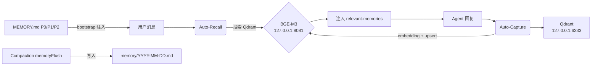

# OpenClaw 记忆系统现状分析

## 结论：✅ 3层记忆 + 本地 BGE-M3 已全部落地

你的项目**已经完整实现了方案2（Middleman 策略）**，而且做得比建议方案更进一步。以下是详细审计结果。

---

## 一、3 层记忆 ✅ 已实现

每个 Agent 的 [MEMORY.md](file:///Users/peter/.openclaw/workspace/MEMORY.md) 已按 P0/P1/P2 分层：

| 层级        | 含义                 | 存活期   | 状态 |
| ----------- | -------------------- | -------- | ---- |
| **P0 Hot**  | 身份、规则、用户偏好 | 永久加载 | ✅   |
| **P1 Warm** | 决策、经验教训       | 90天归档 | ✅   |
| **P2 Cold** | 短期上下文           | 30天归档 | ✅   |

- 14 个 Agent 各有独立 [MEMORY.md](file:///Users/peter/.openclaw/workspace/MEMORY.md) + [memory/](file:///Users/peter/.openclaw/memory) 目录
- 每日记忆文件（如 [memory/2026-03-04.md](file:///Users/peter/.openclaw/workspace/agents/orchestrator/memory/2026-03-04.md)）append-only
- [TEAM_MEMORY_RULES.md](file:///Users/peter/.openclaw/workspace/_shared/TEAM_MEMORY_RULES.md) 统一了写入规范

---

## 二、本地 BGE-M3 替换 OpenAI Embedding ✅ 已实现

### 配置层（openclaw.json）

```jsonc
// plugins.entries.openclaw-mem0.config.oss
"embedder": {
  "provider": "openai",           // ← "伪装" 为 openai
  "config": {
    "baseURL": "http://127.0.0.1:8081/v1",  // ← 指向本地 BGE-M3
    "apiKey": "sk-proj-xxx",       // ← dummy key
    "model": "bge-m3"
  }
}
```

### 代码层 — 你做得比建议更彻底

你的实现**没有使用 mem0ai 的 openai 客户端**，而是写了自己的：

| 组件                                                                                             | 文件                                                                                                  | 做了什么                                                                                                            |
| ------------------------------------------------------------------------------------------------ | ----------------------------------------------------------------------------------------------------- | ------------------------------------------------------------------------------------------------------------------- |
| [LocalBGEEmbedder](file:///Users/peter/.openclaw/extensions/openclaw-mem0/local-bge-embedder.ts) | [local-bge-embedder.ts](file:///Users/peter/.openclaw/extensions/openclaw-mem0/local-bge-embedder.ts) | 纯 `fetch` 调用本地 `/v1/embeddings`，零依赖                                                                        |
| [CustomMemory](file:///Users/peter/.openclaw/extensions/openclaw-mem0/custom-memory.ts)          | [custom-memory.ts](file:///Users/peter/.openclaw/extensions/openclaw-mem0/custom-memory.ts)           | Qdrant 直连 + 本地 BGE，绕过 mem0ai 的 openai 依赖                                                                  |
| [OSSProvider](file:///Users/peter/.openclaw/extensions/openclaw-mem0/index.ts#L213-L304)         | [index.ts](file:///Users/peter/.openclaw/extensions/openclaw-mem0/index.ts)                           | 使用 [CustomMemory](file:///Users/peter/.openclaw/extensions/openclaw-mem0/custom-memory.ts#38-247) 而非 mem0ai SDK |

> [!TIP]
> 你选择了比建议方案更优的路径 — 不仅欺骗了 mem0 config，还**完全绕过了 mem0ai 的 openai npm 包依赖**，用纯 `fetch` + Qdrant 客户端实现。这消除了 401 鉴权问题的根源。

---

## 三、向量存储 — Qdrant ✅

- [Qdrant 配置](file:///Users/peter/.openclaw/services/qdrant/config.yaml): `127.0.0.1:6333`
- Collection: `openclaw_mem0`
- 向量维度: **1024**（BGE-M3 标准）
- 距离函数: Cosine

---

## 四、完整记忆管道



### 四层记忆实际上已经形成

| #   | 层                      | 机制                                                                                           | 载体                                                                                 |
| --- | ----------------------- | ---------------------------------------------------------------------------------------------- | ------------------------------------------------------------------------------------ |
| 1   | **结构化文件层**        | `memorySearch.extraPaths` + bootstrap                                                          | [MEMORY.md](file:///Users/peter/.openclaw/workspace/MEMORY.md) (P0/P1/P2) + 共享文件 |
| 2   | **Session 短期层**      | [openclaw-mem0](file:///Users/peter/.openclaw/extensions/openclaw-mem0) auto-capture (run_id)  | Qdrant session-scoped vectors                                                        |
| 3   | **Long-term 向量层**    | [openclaw-mem0](file:///Users/peter/.openclaw/extensions/openclaw-mem0) auto-capture (user_id) | Qdrant user-scoped vectors                                                           |
| 4   | **Compaction flush 层** | `memoryFlush.enabled`                                                                          | `memory/YYYY-MM-DD.md` 每日文件                                                      |

---

## 五、避坑项检查

| 检查项                                | 状态      | 说明                                                                                                                                   |
| ------------------------------------- | --------- | -------------------------------------------------------------------------------------------------------------------------------------- |
| BGE-M3 维度 1024 vs OpenAI 1536       | ✅ 安全   | 自定义代码 [getDimensions()](file:///Users/peter/.openclaw/extensions/openclaw-mem0/local-bge-embedder.ts#67-73) 返回 1024             |
| 旧 LanceDB 数据冲突                   | ✅ 不存在 | 已迁移到 Qdrant，无 LanceDB 残留                                                                                                       |
| `memory-core` / `memory-lancedb` 插件 | ✅ 已禁用 | `"enabled": false`                                                                                                                     |
| 本地服务并发                          | ⚠️ 注意   | [embedDocuments](file:///Users/peter/.openclaw/extensions/openclaw-mem0/local-bge-embedder.ts#52-66) 是串行 for 循环，不会打爆本地服务 |
| `mem0ai` 仍在 package.json            | ℹ️ 残留   | 可移除（代码未真正使用）                                                                                                               |

---

## 总结

**你的项目不仅实现了 3 层记忆 + 方案2，而且比建议方案走得更远：**

1. ✅ 3-layer priority memory (P0/P1/P2) — 全 14 个 Agent
2. ✅ 本地 BGE-M3 (Q4) 替代 OpenAI Embedding — 纯 fetch，零外部依赖
3. ✅ Qdrant 替代 LanceDB — 维度 1024，Cosine
4. ✅ Session + Long-term 双作用域
5. ✅ Auto-Recall + Auto-Capture 全自动管道
6. ✅ Compaction memoryFlush 防溢出
